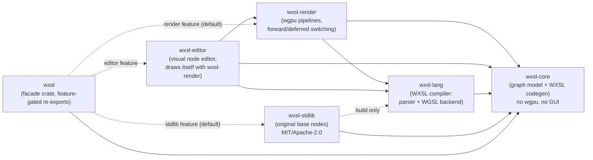
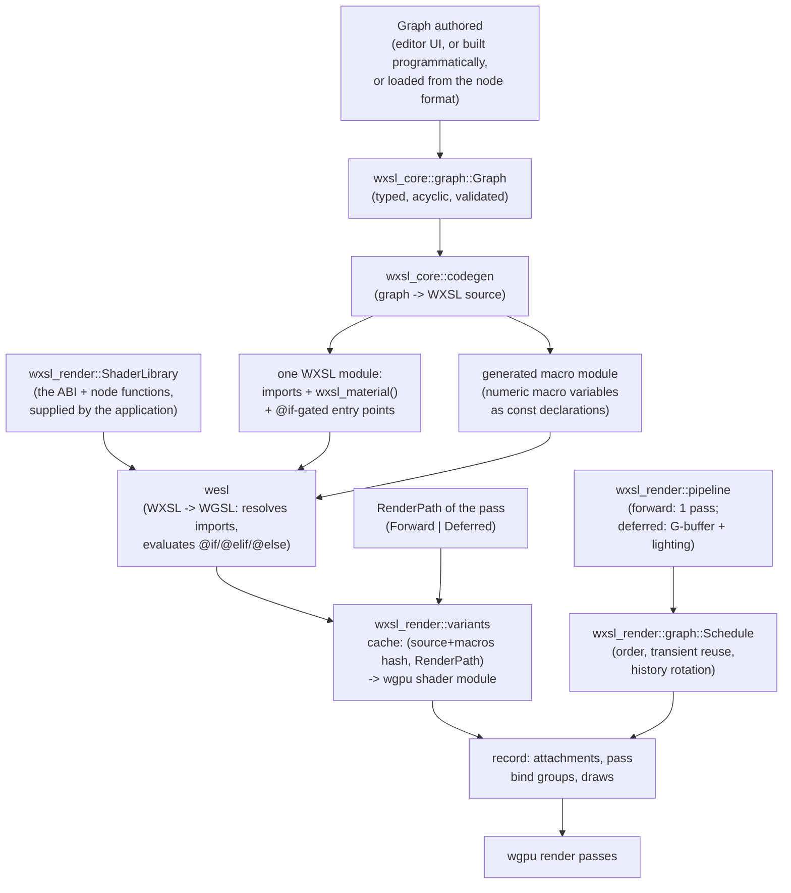

# Architecture map

This is the map; the ADRs in `docs/adr/` are the territory's legal record.
When the two disagree, trust the ADRs and fix this file.

## Vision, one paragraph

`wxsl` lets you build a material/shader as a node graph (visually, via
`wxsl-editor`, or programmatically against `wxsl-core` directly),
compiles that graph to [WXSL](https://wesl-lang.dev), and runs it through a
`wgpu` renderer (`wxsl-render`) that can switch between forward and
deferred rendering without you maintaining two graphs. An original,
from-scratch library of granular base nodes (`wxsl-stdlib`) — math,
color, lighting, SDFs, noise, and so on, in the spirit of libraries like
[LYGIA](https://lygia.xyz) but not derived from one — ships as part of the
default build (ADR 0007).

## Crate graph



Arrows point from dependent to dependency. The only crate every build
includes is `wxsl-core`. See
[ADR 0002](adr/0002-cargo-workspace-crate-boundaries.md) for why the split
exists and which edges must never appear, and
[ADR 0016](adr/0016-syntax-highlighting-reuses-wxsl-langs-lexer.md) for why
`editor --> lang` exists (the code panels' syntax highlighting reuses the
compiler's own lexer).

Two of those edges are about node definitions being read out of shader
sources ([ADR 0020](adr/0020-a-node-definition-is-derived-from-its-wxsl-source.md)).
`lang --> core` is there because the derivation answers in the graph model's
terms — it hands back a `NodeDefinition`. `stdlib -. build only .-> lang` is
dashed for a reason worth knowing: the compiler is a **build**-dependency of
the node library, so the library derives its nodes at build time and the
shipped crate carries no compiler. `cargo tree -p wxsl-stdlib -e normal`
shows `wxsl-core` and nothing else.

## Module map

What lives where, now that the crates have contents. Each module's own doc
comment is the detailed version.

**`wxsl-core`** — `node` (value types, sockets, `WeslFunction`
descriptors, `NodeDefinition`, the registry), `graph` (nodes, edges,
validation, traversal, the serialized node format), `codegen` (graph → WXSL,
plus the generated macro module), `macros` (macro variables), `abi` (the
shader ABI's names and field tables), `wesl` (identifier/float/hash helpers),
`error`.

**`wxsl-stdlib`** — `shaders` (the embedded `.wxsl` sources, keyed by
module path), `registry` (the operators as node definitions, plus the
function nodes `build.rs` derived from the sources).

**`wxsl-render`** — `path` (`RenderPath`), `library` (`ShaderLibrary`),
`material` (a graph compiled to WXSL), `variants` (WXSL → WGSL and the
variant cache), `pipeline` (the `Pipeline` trait, forward and deferred),
`renderer` (the front end that hides the path switch), `scene` (camera,
lights, uniform layouts), `mesh` (vertex format, cube, sphere, plane, torus),
`gpu` (device setup, offscreen rendering and readback), `error`, and `ui` —
the 2D layer with nothing to do with materials (ADR 0013): `draw` (the
instanced primitive and the draw list), `atlas` (the shared glyph and image
texture), `msdf` (distance fields from outlines, on the CPU), `msdf_gpu` (the
same as a compute pass, and the backend switch), `font` (outlines and metrics
from bytes the application supplies), `text` (the glyph cache and shaping),
`input` (windowing-agnostic events), `renderer` (the UI pass).

**`wxsl-editor`** — `app` (the `Editor`: panels, frame, shortcuts), `canvas`
(the pan/zoom node canvas: layout, links, hit-testing, dragging), `highlight`
(colouring the WXSL/WGSL code panels, from `wxsl-lang`'s own lexer), `palette`
(searching the node library), `preview` (the offscreen material preview and
the compiled WXSL and WGSL), `ui` (the immediate-mode layer: identity,
interaction, widgets), `widgets` (editors per socket type, and the colour
picker), `theme`.

**`wxsl`** — feature-gated re-exports, plus `stdlib_library()`, the one
line that hands the node library's WXSL to the renderer.

## Feature flags (`wxsl` facade crate)

| Feature | Default | Adds | Implies |
|---|---|---|---|
| `render` | **on** | `wxsl-render` (wgpu pipelines) | — |
| `stdlib` | **on** | `wxsl-stdlib` (original base nodes) | — |
| `editor` | off | `wxsl-editor` (visual node editor) | `render` |
| `gltf` | off | glTF/GLB geometry import (`wxsl_render::gltf`) | `render` |

A headless runtime that just loads and runs a pre-authored graph can use
`default-features = false, features = ["render"]` — no GUI toolkit anywhere
in its dependency tree. A build with nothing but `wxsl-core` (e.g. an
offline graph validator/exporter) uses `default-features = false` with no
features at all.

## Data flow: authoring to pixels



The `RenderPath` is a property of the *pass*, never of the *graph* — a
material graph is written once and works under either path because the
path-specific differences are expressed as conditional compilation inside
one WXSL module, not as two separate graphs. See
[ADR 0005](adr/0005-render-pipeline-abstraction-and-shader-switching.md).

## How a frame is drawn

A pipeline is not a Rust struct: it is a list of `PassDesc`s over a set of
`ResourceDesc`s — a `wxsl_render::graph::RenderGraph`. `pipeline.rs` builds
the two stock ones (`forward_graph`, `deferred_graph`); an application
building its own hands it to `Renderer::set_graph`.

`RenderGraph::schedule` is a pure function and is tested without a device.
It orders the passes by what they read and write (never by declaration
order), validates them, and decides which physical texture serves each
resource. `ResourcePool` then owns the textures, and `RenderGraph::record`
opens each pass, resolves its attachments, builds its pass bind group from
its declared reads and hands it to the renderer to draw into.

Two properties of a resource are worth knowing before you need them:

* **Persistence.** `Transient` is created at first write and its texture is
  reusable after its last read; `Persistent { history: n }` is a ring of
  `n + 1` textures, so a pass can read what a previous frame wrote. Reading
  history creates no ordering edge — that is what keeps a temporal pass from
  being a cycle.
* **Dimension.** 2D, 2D array, cube or 3D, because cascaded shadows,
  reflection probes and volumetrics each want a different one.

The frame's own target is resource 0, `RenderGraph::TARGET`, and is
*imported*: the caller supplies a view for it each frame.

## What a frame draws

A **scene** — `wxsl_core::scene::Scene` — is meshes, materials and
instances, and it is pure serializable data with no `wgpu` in it. It says
what exists; it says nothing about how it is drawn, because the pipeline
belongs to the renderer.

The renderer takes a `DrawList`: geometry, a material, a transform and the
`Tags` the material was authored with. A geometry pass draws a **tag
expression** over it (`opaque`, `opaque && !outlined`, `*`), so the material
says what it *is* and the pass says what it *draws*. Translating a scene
document into a draw list needs the node registry and a device at once, so
it is the facade's job: `wxsl::scene::SceneResources`.

`wxsl_render::environment::Environment` is the other half of a frame:
camera, lights, ambient, exposure, time. Every draw's transform goes into
one storage buffer in the frame group, indexed by
`@builtin(instance_index)`, so a draw's position in the list is its row.
See [ADR 0021](adr/0021-a-declarative-render-graph-and-a-scene-document.md).

## What a graph is responsible for

A material graph describes a *surface*, not a whole shader: it compiles to
one function taking the per-fragment `SurfaceContext` and returning a
`Surface` (base colour, metallic, roughness, normal, emissive, occlusion,
alpha). Codegen wraps that in the entry points, and the vertex stage, light
loop and G-buffer packing are hand-written WXSL in `wxsl-stdlib`.

`wxsl_core::abi` is where the two halves agree on names and field
layouts, and where the render-path flag and the macro variables the ABI
honours are declared. See
[ADR 0008](adr/0008-surface-graphs-and-a-named-shader-abi.md).

Both paths call the *same* `shade_surface` function — the forward fragment
entry directly, the deferred lighting pass after unpacking the G-buffer — so
the two cannot drift apart in what lighting means. `crates/wxsl/tests/`
asserts they render the same image.

## Bind groups

WebGPU guarantees only four bind groups, so all four are allocated up front,
ordered by how often their contents change — a backend may disturb
higher-numbered groups when a lower one is rebound.

| # | Slot | Rebound | Holds |
|---|---|---|---|
| 0 | `frame` | per frame | Camera, scene lighting, the instance transform buffer |
| 1 | `material` | per material | A graph's parameters, textures, samplers |
| 2 | `user` | whenever | Nothing wxsl binds — the application's slot |
| 3 | `pass` | per pass | Whatever a pass declares it reads: the G-buffer; the UI pass's viewport and atlas; the MSDF compute pass's buffers |

Instance transforms share the frame group despite changing per draw, as one
read-only storage buffer: one binding and one upload serve the whole frame,
where a group of their own would cost a quarter of the budget. (ADR 0010
chose a per-object uniform at a dynamic offset for this; ADR 0021 took the
storage buffer it had already named as the later option, once a frame drew
more than one thing.) That leaves the application one free slot, not two —
the honest cost of the deferred path needing somewhere to put the G-buffer
while a graph still has to compile for either path.
`wxsl_core::abi::BIND_GROUPS` is the single declaration, and a test in
`wxsl-stdlib` asserts the shipped `.wxsl` binds the groups it names. See
[ADR 0010](adr/0010-four-bind-groups-allocated-by-update-frequency.md) and
[ADR 0021](adr/0021-a-declarative-render-graph-and-a-scene-document.md).

The pass group is no longer hand-written per pipeline: it is built from a
pass's `reads`, in declaration order, at bindings 0..n. The deferred
lighting pass's G-buffer bindings are what that produces for the deferred
pass list, and a screen effect's inputs will be what it produces later.

## Macro variables

Not everything a node needs can be a socket value: a loop bound has to be a
compile-time constant, and a lighting-model switch should remove code rather
than pick between two results. Those are *macro variables*
(`wxsl_core::macros`), declared by node definitions and pinned per graph
in the node format:

| Kind | Becomes | Example |
|---|---|---|
| `Flag(bool)` | a WXSL conditional-translation feature (`@if(name)`) | `wxsl_fbm_ridged`, `wxsl_tonemap` |
| `Int` / `Float` | a `const` the declaring module carries | `WXSL_FBM_OCTAVES` |

A macro is declared, with a default, by the WXSL module that uses it —
`@macro const OCTAVES: i32 = 5;` — and is an ordinary module-scope `const`
after binding, which is why it can be a loop bound or an array size.

Precedence, weakest first: the declaring file's default, each node's declared
default, what the graph pins, then what the application overrides. The whole
set is part of the variant cache key, because the bindings also reach
*imported* modules, whose own defaults are nowhere in the root source.

## The renderer takes its shaders from the application

`wxsl-render` compiles WXSL but ships none — it must not depend on
`wxsl-stdlib` (ADR 0002), so the application hands it a `ShaderLibrary`.
With both facade features on that is `wxsl::stdlib_library()`. This is
also the seam for substituting an ABI module or adding hand-written WXSL. See
[ADR 0009](adr/0009-the-application-supplies-the-shader-library.md).

## The editor draws itself with the renderer

There is no GUI toolkit in this workspace. The editor's chrome is a WXSL
module (`package::wxsl::ui`) compiled by `wxsl-lang` and submitted through
`variants::compile` like any material, and its preview is the real
`Renderer` on the real pipelines — so every frame of editing exercises the
stack the editor exists to author for. [ADR
0013](adr/0013-the-editor-draws-itself-with-wxsl-render.md) records why, and
what it cost (`wxsl-editor` now depends on `wxsl-render`, amending ADR
0004).

Two things follow that are worth knowing before touching either half:

* **Everything on screen is one instance.** A rounded box, a capsule, an
  image and a glyph are the same primitive with a different `kind`; the
  quad's corners come from the vertex index, so there is no vertex or index
  buffer in the UI path at all. The layout is host-shared three ways —
  `abi::UI_ATTRIBUTES`, `wxsl_render::ui::draw::UiInstance`, and
  `shaders/wxsl/ui.wxsl` — and they are edited together.
* **Text is MSDF, generated in-tree, twice.** `ui::msdf` is the reference
  implementation on the CPU and `shaders/wxsl/msdf.wxsl` is the same
  algorithm as a compute pass; `MsdfBackend` picks one at runtime and a test
  asserts they agree. The renderer embeds no font: the application supplies
  the bytes, exactly as it supplies the shader library. [ADR
  0014](adr/0014-msdf-text-with-an-own-generator-and-app-supplied-fonts.md).

## Why WXSL and not raw WGSL

WGSL alone has no imports and no conditional compilation, both of which
this project needs structurally: composing node functions, and branching
shader output per render path or feature. It also has no generics, which
the node system needs so that one authored function can serve `f32`,
`vec2f`, `vec3f` and `vec4f`.

WXSL is a superset of WGSL adding four things — templates, imports,
conditional translation and macro constants — compiled by `wxsl-lang` and
lowered back to WGSL, because WGSL is what `wgpu` consumes.

This started as a dependency on [WESL](https://wesl-lang.dev), which
provides imports and conditional translation. That was
[ADR 0003](adr/0003-wesl-as-the-shading-language.md), now superseded: WESL's
generics do not work (tested, with the evidence recorded in that ADR), and
templates were the feature the node system could not do without.
[ADR 0011](adr/0011-own-the-shading-language.md) records the replacement and
the four cheaper alternatives it rejected first.

## The compiler

`wxsl-lang` is a source-to-WGSL compiler, in pipeline order:

| Stage | Job |
|---|---|
| `lexer` | tokens, plus WGSL's template disambiguation (`a < b` vs `vec3<f32>`) |
| `grammar` | LALRPOP, over the token stream rather than raw text |
| `cond` | evaluate `@if`, bind `@macro const` values — per module, before renaming |
| `resolve` | inline imports, mangle by origin, rewrite references respecting shadowing |
| `mono` | instantiate templates, one copy per set of type arguments |
| — | dead-code elimination from the root's declarations |
| `emit` | WGSL, refusing anything still WXSL-only |

The pass order is an invariant, not a preference:

* `cond` must run before renaming, because an `@if` names macros in its own
  module's vocabulary and a dropped branch should never have its references
  resolved.
* `mono` must run after flattening, because a template and its call sites
  can be in different files, so no per-module pass sees all of them.
* dead-code elimination must run after `mono`, so an instantiation whose
  only caller was itself dropped goes with it.

`resolve` takes the bindings and sequences all of this itself rather than
trusting callers to get it right.

Templates carry one builtin, `components(T)` — the number of scalar
components in a type, folded to an integer literal, so it works as an array
size or a loop bound. Type arguments are written explicitly (which is what
the node graph emits, since a graph knows every socket's type) or inferred
from the arguments by a deliberately shallow rule that errors rather than
guesses. [ADR 0012](adr/0012-monomorphize-templates-on-the-flat-module.md)
records why, and what a full type checker would have cost.

The backend's refusal is deliberate. If an unresolved import, an
uninstantiated template or a surviving `@if` reaches it, the error names the
construct and the pass that should have removed it — instead of `wgpu`
rejecting syntax it has never heard of.

One module sits off that pipeline: `node`, which parses a single file and
answers with the `NodeDefinition` it describes rather than with WGSL
([ADR 0020](adr/0020-a-node-definition-is-derived-from-its-wxsl-source.md)).
It is the only place in the compiler that reads comments, because the node
metadata a signature cannot carry — a label, a socket default — is stated in
them rather than in attributes the compiler would have to thread through
every pass and then ignore.

## The base node library

`wxsl-stdlib` mirrors the category layout common to granular shader
libraries under `crates/wxsl-stdlib/shaders/` (`math/`, `color/`,
`space/`, `lighting/`, `generative/`, `sdf/`, `sample/`, `animation/`,
`filter/`, `distort/`), one `.wxsl` file per function — but every function
is original code, not a port. A `wxsl/` directory alongside them holds the
shader ABI (ADR 0008), which is plumbing rather than granular functions.

Two kinds of node come out of it. Arithmetic is an inline WXSL expression
(`math.add` is `{a} + {b}`), because wrapping an addition in a function call
buys nothing. It is *one* node per operation, not one per operation and
type: the definition declares the types it works over as a type parameter
and its sockets carry it, resolved per graph node from whatever is connected,
and the operators whose two operands WGSL lets differ (`f32 * vec3f`,
`mat3x3f * vec3f`) declare two parameters and derive the result from both
([ADR 0018](adr/0018-one-generic-node-per-operation.md)). Everything with a body — PBR
shading, noise, tonemapping, colour spaces — is a real WXSL function, and
**the file is the node**: its signature gives the sockets, its type
parameter's bound list gives the allowed set, its `@macro const`s give the
macro declarations, and its comments give the label, the documentation and
the socket defaults
([ADR 0020](adr/0020-a-node-definition-is-derived-from-its-wxsl-source.md)).
`wxsl-stdlib/build.rs` runs `wxsl_lang::node_from_source` over every file
under a category directory and writes the results out as the table
`registry.rs` includes, so a function and its node cannot disagree — there
is nowhere for them to disagree — and hand-written WXSL can call the same
function a graph does. An earlier plan to rewrite
[LYGIA](https://lygia.xyz) into WXSL was scrapped once its non-permissive
license ([ADR 0006](adr/0006-lygia-port-licensing-and-isolation.md)) turned
out to be a real adoption cost even fully isolated behind an opt-in
feature; ADR 0007 replaced it with this from-scratch library, which is why
`stdlib` needs no special licensing treatment and defaults on. See
[ADR 0007](adr/0007-original-shader-stdlib-instead-of-a-lygia-port.md) and
`crates/wxsl-stdlib/shaders/README.md`'s authoring rule before adding a
function.

## Current status

Implemented and tested end to end:

| Area | State |
|---|---|
| `wxsl-core`: node/socket model, typed acyclic graph, validation, WXSL codegen, macro variables, node format (serde) | done |
| `wxsl-stdlib`: shader ABI, 100 node definitions over arithmetic, vectors, conversions, logic, colour, space, noise, SDFs, animation, PBR lighting | done |
| `wxsl-render`: WXSL→WGSL compilation, variant cache, forward and deferred pipelines, cube mesh, scene uniforms, offscreen rendering | done |
| `wxsl-render`: the `ui` layer — texture atlas, MSDF text (CPU and compute pass), instanced draw list, input, the UI pass | done |
| `wxsl-editor`: node canvas (pan/zoom, link, unlink, move, delete), searchable palette, live preview, WXSL/WGSL/problem panels, macro and parameter editing, per-node name and colour, light/dark themes | done |
| `wxsl`: facade, `stdlib_library()`, the `pbr_cube` demo, the `editor` demo | done |

The demo is the thing to run first:

```sh
cargo run -p wxsl --example pbr_cube              # windowed; F/D switch path
cargo run -p wxsl --example pbr_cube -- --headless  # both paths to PNG
cargo run -p wxsl --example pbr_cube -- --dump-wgsl # what the graph became
```

And the editor, which is the same graph with somewhere to edit it:

```sh
cargo run -p wxsl --features editor --example editor
cargo run -p wxsl --features editor --example editor -- --screenshot out.png
```

Test coverage worth knowing about, since it is what keeps the two halves of
the shader ABI honest:

- `crates/wxsl/tests/graph_to_wgsl.rs` compiles *every node in the
  library* to WGSL on both render paths, plus the demo graph, macro
  switching, and the node format's round trip. No GPU needed.
- `crates/wxsl/tests/render_cube.rs` renders the cube through both paths
  on a real device and asserts the images match. Skips when no adapter is
  available.
- `crates/wxsl/tests/editor_frame.rs` drives the editor for several frames
  on a real device: that it draws an interface at all, that editing
  recompiles, that a path switch produces different WGSL, that a frame of
  every input event leaves it drawing — and that both MSDF backends produce
  the same interface, which is what keeps the CPU generator and the compute
  shader honest. Also skips with no adapter.

## See also

- `docs/adr/` — the decision log this map summarizes.
- `docs/glossary.md` — terminology used above without re-explanation.
- `AGENTS.md` (repo root) — process and conventions for making changes here.
