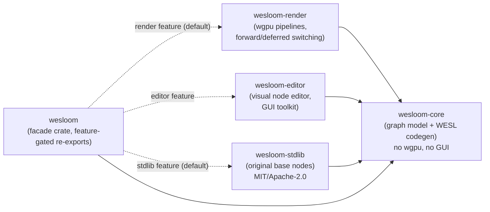
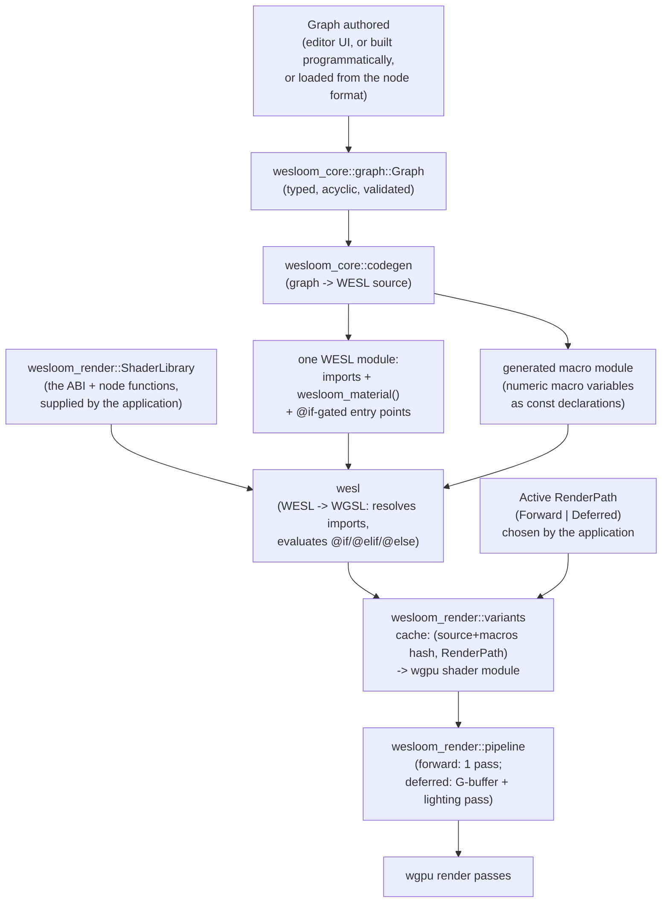

# Architecture map

This is the map; the ADRs in `docs/adr/` are the territory's legal record.
When the two disagree, trust the ADRs and fix this file.

## Vision, one paragraph

`wesloom` lets you build a material/shader as a node graph (visually, via
`wesloom-editor`, or programmatically against `wesloom-core` directly),
compiles that graph to [WESL](https://wesl-lang.dev), and runs it through a
`wgpu` renderer (`wesloom-render`) that can switch between forward and
deferred rendering without you maintaining two graphs. An original,
from-scratch library of granular base nodes (`wesloom-stdlib`) — math,
color, lighting, SDFs, noise, and so on, in the spirit of libraries like
[LYGIA](https://lygia.xyz) but not derived from one — ships as part of the
default build (ADR 0007).

## Crate graph



Arrows point from dependent to dependency. The only crate every build
includes is `wesloom-core`. See
[ADR 0002](adr/0002-cargo-workspace-crate-boundaries.md) for why the split
exists and which edges must never appear.

## Module map

What lives where, now that the crates have contents. Each module's own doc
comment is the detailed version.

**`wesloom-core`** — `node` (value types, sockets, `WeslFunction`
descriptors, `NodeDefinition`, the registry), `graph` (nodes, edges,
validation, traversal, the serialized node format), `codegen` (graph → WESL,
plus the generated macro module), `macros` (macro variables), `abi` (the
shader ABI's names and field tables), `wesl` (identifier/float/hash helpers),
`error`.

**`wesloom-stdlib`** — `shaders` (the embedded `.wesl` sources, keyed by
module path), `registry` (every function and operator as a node definition).

**`wesloom-render`** — `path` (`RenderPath`), `library` (`ShaderLibrary`),
`material` (a graph compiled to WESL), `variants` (WESL → WGSL and the
variant cache), `pipeline` (the `Pipeline` trait, forward and deferred),
`renderer` (the front end that hides the path switch), `scene` (camera,
lights, uniform layouts), `mesh` (vertex format, cube), `gpu` (device setup,
offscreen rendering and readback), `error`.

**`wesloom`** — feature-gated re-exports, plus `stdlib_library()`, the one
line that hands the node library's WESL to the renderer.

## Feature flags (`wesloom` facade crate)

| Feature | Default | Adds | Implies |
|---|---|---|---|
| `render` | **on** | `wesloom-render` (wgpu pipelines) | — |
| `stdlib` | **on** | `wesloom-stdlib` (original base nodes) | — |
| `editor` | off | `wesloom-editor` (visual node editor) | `render` |

A headless runtime that just loads and runs a pre-authored graph can use
`default-features = false, features = ["render"]` — no GUI toolkit anywhere
in its dependency tree. A build with nothing but `wesloom-core` (e.g. an
offline graph validator/exporter) uses `default-features = false` with no
features at all.

## Data flow: authoring to pixels



The `RenderPath` is a property of the *pipeline*, never of the *graph* — a
material graph is written once and works under either path because the
path-specific differences are expressed as conditional compilation inside
one WESL module, not as two separate graphs. See
[ADR 0005](adr/0005-render-pipeline-abstraction-and-shader-switching.md).

## What a graph is responsible for

A material graph describes a *surface*, not a whole shader: it compiles to
one function taking the per-fragment `SurfaceContext` and returning a
`Surface` (base colour, metallic, roughness, normal, emissive, occlusion,
alpha). Codegen wraps that in the entry points, and the vertex stage, light
loop and G-buffer packing are hand-written WESL in `wesloom-stdlib`.

`wesloom_core::abi` is where the two halves agree on names and field
layouts, and where the render-path flag and the macro variables the ABI
honours are declared. See
[ADR 0008](adr/0008-surface-graphs-and-a-named-shader-abi.md).

Both paths call the *same* `shade_surface` function — the forward fragment
entry directly, the deferred lighting pass after unpacking the G-buffer — so
the two cannot drift apart in what lighting means. `crates/wesloom/tests/`
asserts they render the same image.

## Macro variables

Not everything a node needs can be a socket value: a loop bound has to be a
compile-time constant, and a lighting-model switch should remove code rather
than pick between two results. Those are *macro variables*
(`wesloom_core::macros`), declared by node definitions and pinned per graph
in the node format:

| Kind | Becomes | Example |
|---|---|---|
| `Flag(bool)` | a WESL conditional-translation feature (`@if(name)`) | `wesloom_fbm_ridged`, `wesloom_tonemap` |
| `Int` / `Float` | a `const` in the generated macro module | `WESLOOM_FBM_OCTAVES` |

Precedence, weakest first: the ABI's defaults, each node's declared default,
what the graph pins, then what the application overrides. The whole set is
part of the variant cache key, because neither kind shows up in the root
module's own declarations.

## The renderer takes its shaders from the application

`wesloom-render` compiles WESL but ships none — it must not depend on
`wesloom-stdlib` (ADR 0002), so the application hands it a `ShaderLibrary`.
With both facade features on that is `wesloom::stdlib_library()`. This is
also the seam for substituting an ABI module or adding hand-written WESL. See
[ADR 0009](adr/0009-the-application-supplies-the-shader-library.md).

## Why WESL and not raw WGSL

WGSL alone has no imports and no conditional compilation, both of which
this project needs structurally (composing node functions; branching
shader output per render path/feature). WESL adds both, with a real Rust
compiler (`wesl` crate) behind it, developed by the same community as
`wgsl-parse`/`wgsl-analyzer`. See
[ADR 0003](adr/0003-wesl-as-the-shading-language.md) for the full reasoning
and the alternatives it rejected.

## The base node library

`wesloom-stdlib` mirrors the category layout common to granular shader
libraries under `crates/wesloom-stdlib/shaders/` (`math/`, `color/`,
`space/`, `lighting/`, `generative/`, `sdf/`, `sample/`, `animation/`,
`filter/`, `distort/`), one `.wesl` file per function — but every function
is original code, not a port. A `wesloom/` directory alongside them holds the
shader ABI (ADR 0008), which is plumbing rather than granular functions.

Two kinds of node come out of it. Arithmetic is an inline WESL expression
generated per value type (`math.add.vec3f` is `{a} + {b}`), because wrapping
an addition in a function call buys nothing. Everything with a body — PBR
shading, noise, tonemapping, colour spaces — is a real WESL function
described by a `WeslFunction` giving its module, name, parameters and return
shape, so the WESL source stays the single definition of the behaviour and
hand-written WESL can call the same function a graph does. An earlier plan to rewrite
[LYGIA](https://lygia.xyz) into WESL was scrapped once its non-permissive
license ([ADR 0006](adr/0006-lygia-port-licensing-and-isolation.md)) turned
out to be a real adoption cost even fully isolated behind an opt-in
feature; ADR 0007 replaced it with this from-scratch library, which is why
`stdlib` needs no special licensing treatment and defaults on. See
[ADR 0007](adr/0007-original-shader-stdlib-instead-of-a-lygia-port.md) and
`crates/wesloom-stdlib/shaders/README.md`'s authoring rule before adding a
function.

## Current status

Implemented and tested end to end, except the editor:

| Area | State |
|---|---|
| `wesloom-core`: node/socket model, typed acyclic graph, validation, WESL codegen, macro variables, node format (serde) | done |
| `wesloom-stdlib`: shader ABI, 215 node definitions over arithmetic, vectors, conversions, logic, colour, space, noise, SDFs, animation, PBR lighting | done |
| `wesloom-render`: WESL→WGSL compilation, variant cache, forward and deferred pipelines, cube mesh, scene uniforms, offscreen rendering | done |
| `wesloom`: facade, `stdlib_library()`, the `pbr_cube` demo | done |
| `wesloom-editor` | **scaffolding** — module stubs only, no UI (ADR 0004) |

The demo is the thing to run first:

```sh
cargo run -p wesloom --example pbr_cube              # windowed; F/D switch path
cargo run -p wesloom --example pbr_cube -- --headless  # both paths to PNG
cargo run -p wesloom --example pbr_cube -- --dump-wgsl # what the graph became
```

Test coverage worth knowing about, since it is what keeps the two halves of
the shader ABI honest:

- `crates/wesloom/tests/graph_to_wgsl.rs` compiles *every node in the
  library* to WGSL on both render paths, plus the demo graph, macro
  switching, and the node format's round trip. No GPU needed.
- `crates/wesloom/tests/render_cube.rs` renders the cube through both paths
  on a real device and asserts the images match. Skips when no adapter is
  available.

## See also

- `docs/adr/` — the decision log this map summarizes.
- `docs/glossary.md` — terminology used above without re-explanation.
- `AGENTS.md` (repo root) — process and conventions for making changes here.
