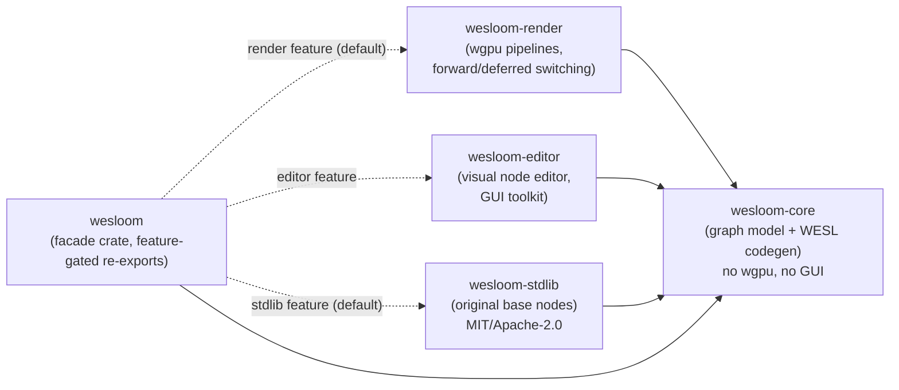
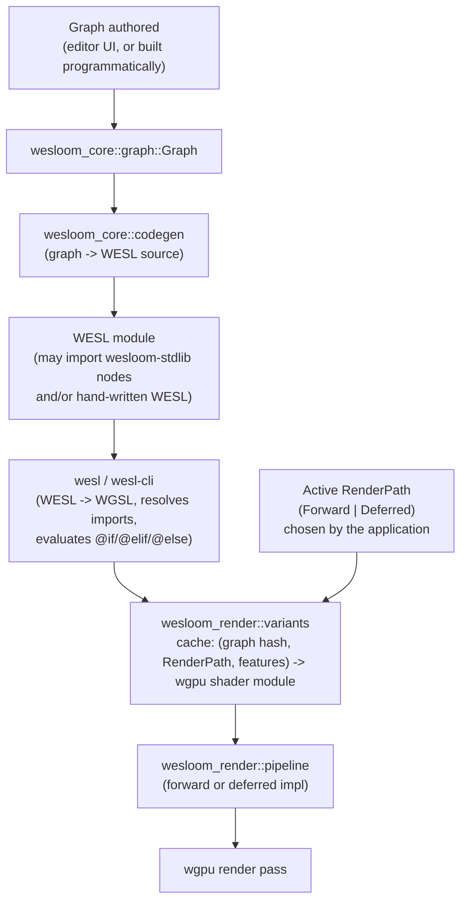

# Architecture map

This is the map; the ADRs in `docs/adr/` are the territory's legal record.
When the two disagree, trust the ADRs and fix this file.

## Vision, one paragraph

`wesloom` lets you build a material/shader as a node graph (visually, via
`wesloom-editor`, or programmatically against `wesloom-core` directly),
compiles that graph to [WESL](https://wesl-lang.dev), and runs it through a
`wgpu` renderer (`wesloom-render`) that can switch between forward and
deferred rendering without you maintaining two graphs. An original,
from-scratch library of granular base nodes (`wesloom-stdlib`) — math,
color, lighting, SDFs, noise, and so on, in the spirit of libraries like
[LYGIA](https://lygia.xyz) but not derived from one — ships as part of the
default build (ADR 0007).

## Crate graph

Arrows point from dependent to dependency. The only crate every build
includes is `wesloom-core`. See
[ADR 0002](adr/0002-cargo-workspace-crate-boundaries.md) for why the split
exists and which edges must never appear.

## Feature flags (`wesloom` facade crate)

| Feature | Default | Adds | Implies |
|---|---|---|---|
| `render` | **on** | `wesloom-render` (wgpu pipelines) | — |
| `stdlib` | **on** | `wesloom-stdlib` (original base nodes) | — |
| `editor` | off | `wesloom-editor` (visual node editor) | `render` |

A headless runtime that just loads and runs a pre-authored graph can use
`default-features = false, features = ["render"]` — no GUI toolkit anywhere
in its dependency tree. A build with nothing but `wesloom-core` (e.g. an
offline graph validator/exporter) uses `default-features = false` with no
features at all.

## Data flow: authoring to pixels

The `RenderPath` is a property of the *pipeline*, never of the *graph* — a
material graph is written once and works under either path because the
path-specific differences are expressed as conditional compilation inside
one WESL module, not as two separate graphs. See
[ADR 0005](adr/0005-render-pipeline-abstraction-and-shader-switching.md).

## Why WESL and not raw WGSL

WGSL alone has no imports and no conditional compilation, both of which
this project needs structurally (composing node functions; branching
shader output per render path/feature). WESL adds both, with a real Rust
compiler (`wesl` crate) behind it, developed by the same community as
`wgsl-parse`/`wgsl-analyzer`. See
[ADR 0003](adr/0003-wesl-as-the-shading-language.md) for the full reasoning
and the alternatives it rejected.

## The base node library

`wesloom-stdlib` mirrors the category layout common to granular shader
libraries under `crates/wesloom-stdlib/shaders/` (`math/`, `color/`,
`space/`, `lighting/`, `generative/`, `sdf/`, `sample/`, `animation/`,
`filter/`, `distort/`), one `.wesl` file per function — but every function
is original code, not a port. An earlier plan to rewrite
[LYGIA](https://lygia.xyz) into WESL was scrapped once its non-permissive
license ([ADR 0006](adr/0006-lygia-port-licensing-and-isolation.md)) turned
out to be a real adoption cost even fully isolated behind an opt-in
feature; ADR 0007 replaced it with this from-scratch library, which is why
`stdlib` needs no special licensing treatment and defaults on. See
[ADR 0007](adr/0007-original-shader-stdlib-instead-of-a-lygia-port.md) and
`crates/wesloom-stdlib/shaders/README.md`'s authoring rule before adding a
function.

## Current status

Scaffolding only: the crate boundaries, feature flags, and this
documentation exist; the graph model, codegen, `wgpu` pipelines, editor UI,
and base node library are all unimplemented. Each module stub's doc comment
says what belongs there and which ADR governs it — start from
`crates/*/src/lib.rs`.

## See also

- `docs/adr/` — the decision log this map summarizes.
- `docs/glossary.md` — terminology used above without re-explanation.
- `AGENTS.md` (repo root) — process and conventions for making changes here.
