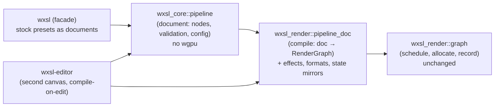

# Pipeline architecture proposal

The architecture behind plan2.md's P2–P5, written out: where the
abstraction lives, what each layer holds, how a pipeline goes from a
document the user edits to a frame the renderer records — and what each
piece costs. Written to be turned into ADRs as the pieces land; nothing
in it is decided until then.

## The answer, first: which crate holds what

The abstraction is **split deliberately, and most of it does live in
`wxsl-core`** — but not the part that touches `wgpu`. The split is the
same one the scene already uses, and for the same reasons:

| Concern | Lives in | Why |
|---|---|---|
| The pipeline **document**: node vocabulary, validation, typed sockets, `PipelineConfig` | `wxsl_core::pipeline` (new) | It is pure serializable data, like `wxsl_core::scene`. No `wgpu`, no GUI — the crate's whole point (ADR 0002). |
| The **compiler**: document → `RenderGraph` | `wxsl_render` (new module, e.g. `pipeline_doc`) | `RenderGraph`, the thing it compiles *to*, is a `wxsl-render` type (its `PassState` and `ResourceDesc` name `wgpu` enums). The arrow already points render → core; the reverse must never appear. |
| The **effects**: shader sources, expansion descriptors | `wxsl-stdlib` ships them; `wxsl-render` defines the seam | ADR 0009's rule, extended: the renderer compiles shaders but ships none. Effects are the pass-level instance of that. |
| The **presets** (stock pipelines as documents) | `wxsl` facade (shipped assets) | The facade is where the application gets "library + models + pipelines" in one call, the way `stdlib_library()` works today. |
| The **canvas** | `wxsl-editor` | A second instance of the existing canvas over a different node registry — not a second editor. |



The runtime hook already exists: `Renderer::set_graph` and
`Renderer::request_graph` take anyone's `RenderGraph` today. What is
missing is everything *upstream* of them — which is exactly the part
that is currently hard-coded Rust.

## Layer 1 — the document (`wxsl_core::pipeline`)

### Reuse the graph model, do not fork it

The pipeline document is a `wxsl_core::graph::Graph` — the same type the
material canvas edits — over a **different node registry**. This is the
single most important decision, and plan.md's own guard rail already
argues for it: "a pipeline graph is a second canvas over the same model,
not a second editor." Forking the data model would, three steps later,
fork the canvas, the serialization, the hit-testing and the undo story.

Precedents that make this fit rather than a stretch:

* **Edges already carry handles.** M3 added `ValueType::Texture2d` /
  `Sampler` — socket types that name a *resource* rather than a value,
  deliberately outside `ValueType::ALL`. Pipeline edges are the same
  trick with a few more entries: `ColorTarget`, `DepthTarget`,
  `DrawQueue`, `ShadowMaps`. All handle types, all outside `ALL`, so
  arithmetic nodes can never touch them.
* **Per-instance settings already exist.** A pipeline node's tag
  expression, material stage, cull mode, persistence, layer count and
  resolution scale are `SettingDef`s — the mechanism `param.value`,
  `input.attribute` and the varying output already use (M3/M4/M5).
* **Serialization already exists.** The node format round-trips a `Graph`
  through JSON (`assets/pbr_cube.wxsl.json`); a preset *is* one of those
  files with pipeline nodes in it.

### The node vocabulary

Fixed and small, generated by a function in the module — the same shape
as `abi::context_node_defs()` — so applications can add to it but the
shipped vocabulary is one reviewable table:

| Node | Outputs | Inputs / settings | Compiles to |
|---|---|---|---|
| `source.scene` | `DrawQueue` | tag expression (setting) | the draw list, filtered |
| `source.camera` | `Camera` (handle) | which camera | frame group input |
| `source.lights` | `ShadowMaps` | count, resolution | the frame group's shadow array |
| `pass.geometry` | `ColorTarget`s, `DepthTarget` | `DrawQueue`, stage, state, view, depth compare | one `PassDesc::geometry` |
| `pass.screen` | `ColorTarget` | effect id (setting), `ColorTarget` inputs | one `PassDesc::screen` over an effect |
| `pass.compute` | targets/storage | effect id, dispatch shape | one `PassDesc::compute` |
| `resource.target` | `ColorTarget` or `DepthTarget` | precision, scale, layers, persistence | one `ResourceDesc` |
| `present` | — (terminal) | target | the imported `RenderGraph::TARGET` |

Validation is document-level and device-free: acyclicity and typing come
from the graph model for free; the module adds what is pipeline-specific
(a `DrawQueue` exists, the terminal is `present` and unique, every target
is written before it is read — or left to the compiler to name better).

`PipelineConfig` (plan2 P2) lives here too: target size/format policy,
the lighting set, enabled effects — the single value the compiler takes
beside the document, so a pipeline's *shape* (document) is separate from
its *knobs* (config).

## Layer 2 — the compiler (`wxsl_render::pipeline_doc`)

One pure function, no device:

```rust
pub fn compile(
    document: &Graph,
    registry: &NodeRegistry,     // the pipeline registry
    effects: &EffectRegistry,
    config: &PipelineConfig,
) -> Result<RenderGraph, PipelineError>;
```

It walks the document, allocates `ResourceDesc`s from `resource.target`
nodes, builds `PassDesc`s from pass nodes, and hands the result to the
existing `RenderGraph::schedule`. Three mapping jobs, each small and each
a *mirror with a test*, which is M6's lesson about mirrors:

* **Precisions → formats.** Documents say `Normalized` /
  `HighDynamicRange` / scalar / pair — the abstract vocabulary
  `GBufferPrecision` already established. `wxsl-render` maps them
  (it already has `gbuffer_format`). The document never names a concrete
  format, so `wxsl-core` stays clean and the budget arithmetic
  (`gbuffer_bytes_per_sample`) applies unchanged.
* **State → `wgpu` enums.** Compare functions, blend states and cull
  modes need core-side enums mirrored to `wgpu`'s — the same split as
  `MacroValue` vs `wxsl_lang::Value` ("two spellings, on purpose"). A
  dozen variants each; the mirror test is what keeps them honest.
* **Effects → passes.** See the next section.

Error quality is a feature, not an afterthought: every failure names the
*document node* ("`pass.screen 'bloom up' reads 'blur B', which nothing
writes`"), because the reader is a user looking at a canvas, not the
scheduler reading a built list. The scheduler stays pure and unchanged —
the compiler is the layer that turns canvas mistakes into named errors
before the scheduler's own checks double as the last line.

## Layer 3 — effects (`EffectRegistry`, the seam)

An effect is the pass-level twin of a node: a self-describing unit that
says what it reads and writes, which shader it runs, and what parameters
it takes. Concretely:

```rust
pub struct EffectDesc {
    pub id: &'static str,               // "deferred_lighting", "bloom"
    pub kind: EffectKind,               // Screen | Compute
    pub shader: ShaderSource,           // template file (P1) or screen graph (M7)
    pub inputs: Vec<Slot>,              // typed: ColorTarget, DepthTarget, …
    pub outputs: Vec<Slot>,
    pub params: Vec<ParamDef>,          // become macros or a uniform block
}
```

`pass.screen` nodes reference effects by id (a setting), and the
compiler expands the reference into a `PassDesc` whose `reads`/writes
match the slots. The first effect is the existing deferred lighting pass,
migrated — it is already a fullscreen pass with a generated shader and
declared reads, just hard-coded as `ScreenShader::DeferredLighting`.
Tonemap moves here (plan.md's M7 wants it out of `shade_surface`), and
bloom — once M7's screen domain exists — is one effect rather than a
chain of bespoke passes.

The registry is application-supplied like the shader library (ADR 0009
extended from shaders to passes): `wxsl-stdlib` ships the standard set,
an application adds its own without touching `wxsl-render`. Effects
authored as *screen graphs* (M7's `GraphDomain::Screen`) slot in behind
the same seam — the descriptor's `ShaderSource` is the extension point.

## Layer 4 — presets and the facade

`Forward` and `Deferred` become **preset documents shipped as assets**
(`crates/wxsl/assets/forward.pipeline.json`), loaded by
`wxsl::stock_pipeline(name)` beside `stdlib_library()`. `StockPipeline`
stays as the enum users switch on, but its `graph()` method loads a
document and compiles it.

One rule from the repo's own history applies twice over here — the
`msdf` rule, "two implementations must agree": a test compiles each
preset document and asserts the resulting `RenderGraph` is *identical*
to the hand-built one (`forward_graph` / `deferred_graph`). The
hand-built versions stay in the tree as the reference until the presets
are trusted, then retire or remain as tests' builders. A preset that
regresses against the reference is a failed test, not a subtly different
frame.

## Layer 5 — the editor

A second canvas instance over the pipeline registry, wired like the
material one:

* open a preset (or an empty document), see its nodes, rewire, add an
  effect from a palette (the palette component is generic over a
  registry already);
* on every edit: validate, compile, `Renderer::set_graph` — the preview
  then renders the *user's* pipeline, live, because the preview already
  runs the real renderer (ADR 0013 paying off again);
* compile errors land in the existing problem panel, naming nodes.

No new widget vocabulary. The cost here is wiring and state management,
not invention — but it is the cost that makes the abstraction *friendly*
rather than merely present, so it is scoped, not cut.

## Cost

Calibrated against M6 (a full milestone, the unit this repo's planning
uses), with the repo's quality bar included — tests, ADR, runnable demo
— because leaving it out is how plans lie:

| Step | What lands | Cost | Unblocks |
|---|---|---|---|
| P2 — `PipelineConfig` | one struct threaded through `StockPipeline`/`Renderer`/variants | ~0.5 day | everything below; every future knob |
| P6 — DX floor | shader corpus gate, error scopes in GPU tests, spec-table test, test-kit generalization | ~1 day | all shader/pipeline work after it |
| P1 — templates | shading/lighting-pass text out of `format!` into template files | ~1–2 days | M7's effects, M9's bake shaders |
| Document module | `wxsl_core::pipeline`: vocabulary, validation, config, serde via `Graph` | ~2–3 days | compiler, presets, canvas |
| Compiler | doc → `RenderGraph`, precision/state mirrors + mirror tests, named errors | ~2–3 days | presets, canvas |
| Presets + parity | forward/deferred as documents, preset ≡ hand-built assertion | ~1 day | M8 as "another preset" |
| Effects | `EffectRegistry`, lighting pass migrated, tonemap as effect | ~2–4 days | M7's spine, M9's bake |
| Canvas | second canvas, compile-on-edit, live preview, problem panel | ~3–5 days | the "friendly" half |

**Total: roughly one to one-and-a-half milestones for the core arc**
(config, DX, templates, document, compiler, presets — steps 1–6), and a
second one for effects plus the canvas. In exchange:

* M7 (screen domain, postprocess) loses its plumbing half — its new work
  is the screen ABI and screen graphs, on top of a finished effect seam;
* M8 (peeling) becomes two new stages plus a preset document, not a new
  hand-written pass list plus its mirror;
* M9 (bake) is an effect over a material subgraph;
* an application gains "build a pipeline without forking the renderer",
  which is the product goal, not just a maintenance win.

## Will it interop? The boundary, and three things to add

The plan was written for *our* maintenance; cross-author interoperability
is a stricter test. Where it stands:

**What is already data, and so composes across authors today:** scenes,
material graphs, macro pins, tags — and, after this plan, pipelines and
effect *wiring*. Two strangers can exchange a scene, a material, and (post
P3) a pipeline as files, and the facade assembles them. Composition —
the chaining of passes, the mixing of materials in one draw list — is
fully data-oriented, and that is the level where interop actually
matters, because it is the level users touch.

**The honest boundary: leaves are code.** Node bodies that are WXSL
expressions and effect shaders are data too, but any effect needing more
than a fullscreen/compute shader over declared slots — custom pass kinds,
custom allocation — is a Rust `EffectDesc` compiled in. So "integrate
other people's work" means **compile-together interop** (a crate
implementing `EffectDesc`/`NodeDefinition`, exactly how `wxsl-stdlib`
exists), not drop-a-file plugins. A dynamic plugin boundary (wasm or
dylib) is a different project with a stability cost this plan does not
pay. The data end-game for effects is M7's screen graphs: an effect
authored as a graph is pure data end to end, and that is the version
worth pushing for everything that fits one.

Three things the plan must add to make cross-author composition
*predictable* rather than merely possible — folded in as **P8, identity
and contracts**:

1. **Namespaced ids.** Node, effect and lighting-model ids are flat
   strings today (`math.add`, `bloom`); two shipped libraries can
   collide. Make ids `package::name` — the spelling module paths already
   use — and have the registries reject an un-namespaced registration
   from outside the shipped set. Mostly convention plus registry
   validation; trivial next to what it prevents.
2. **Document versions.** Every serialized format (node, scene, pipeline)
   carries a schema version, and the ABI carries a revision the documents
   pin. A file authored against a different ABI says so at load, by
   name — not silently reshades or mis-binds three months later. Small:
   a field, a check, and the discipline to bump.
3. **Capability contracts, checked from data.** Today the
   material↔pipeline and mesh↔material compatibility rules exist as
   scattered runtime checks (the lighting-set mismatch error, the
   attribute check before a pass opens). Hoist them into metadata the
   compiler already computes: a compiled pipeline publishes *provided*
   stages, its G-buffer layout, its lighting set, its required effects;
   a scene's materials *require* stages and models. One
   `RenderSetup::check(&pipeline, &scene)` — no device — returns every
   incompatibility by name, before anything is built. This turns "will
   A's pipeline draw B's scene?" from a runtime surprise into a
   validator answer, and it costs days, not weeks, because all the
   facts are already computed — they are just not published as data.

With P8, the interop story is stated in one sentence: **everything a
user authors or exchanges is data with a version and a namespace; the
engines that consume it are code; compatibility between any two pieces
of data is checkable without a GPU.** That is the property that makes an
ecosystem possible — and the ceiling without it, because no amount of
data-orientation helps if identity is ambiguous and compatibility is
only discoverable by running.

Precedent, for calibration: this is the shape Bevy's render graph and
Unity's SRP landed on (data-authored composition, code-authored leaves,
contracts checked at build/load time), and neither grew a dynamic plugin
boundary until years in. Nothing here forecloses one; P8 is simply the
part that must exist first.

## Risks and open questions

* **Does `Graph` fit pipeline nodes?** The typing machinery is
  value-flavored (generics, splat defaults, arithmetic rules). Handle
  types are precedent, but a *spike first* (one day: express the
  deferred preset as a `Graph` over a trial registry and compile it) is
  the honest way to know. If it truly does not fit, the fallback is a
  sibling document model — at the accepted cost of a forked canvas, so
  the spike must fail decisively to trigger it.
* **Effect ordering and internal resources.** An effect that expands to
  several passes with transient intermediates (bloom's pyramid) asks the
  compiler to synthesize sub-documents. The scheduler handles ordering
  already; the new part is scoped name allocation. Deferred to the
  effects step deliberately.
* **State mirrors drift.** `wgpu` evolves compare/blend enums. The
  mirror test from P6 is the containment; the escape hatch is
  `#[non_exhaustive]` plus a pass-through setting for anything the
  mirrors lack yet.
* **Editor scale.** The canvas was built for material graphs (tens of
  nodes); pipelines are smaller but the state to manage (two graphs, one
  preview renderer per) is new. This is M11-shaped UI work — the plan's
  own note that the editor's costs are always "the bulk of the work"
  applies.

## What deliberately does not change

* `RenderGraph::schedule` — pure, device-free, tested without a GPU.
  Documents compile *into* it; nothing moves out of it.
* The variant cache, bind-group allocation and the ABI's four groups.
* ADR 0002's arrows: core stays wgpu-free; render never learns about
  documents it cannot compile; the facade keeps being the only place
  that assembles library + models + presets.
* The guard rails in plan2.md: one graph model, logic in Rust / text in
  files, every step with an ADR and a runnable demo.
